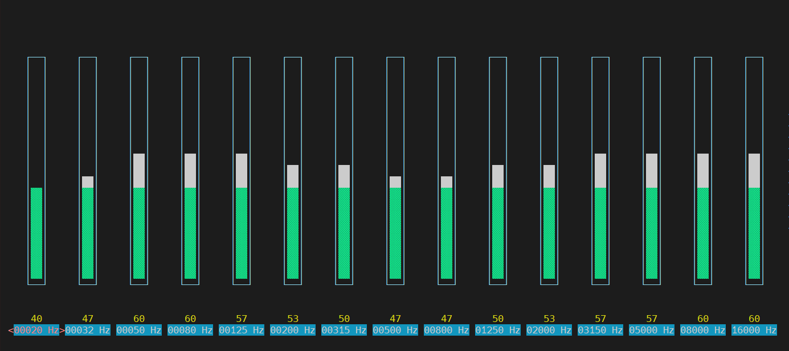

# SquarePi

You already have a Raspberry Pi. You have speakers. SquarePi is the missing piece — a 2×30W Class-D amplifier HAT that turns a bare Pi into a headless, network-connected audio appliance.

One installer. MPD + myMPD out of the box. Optional Bluetooth A2DP. Designed to just work.

*From square wave to every corner.*

**Author:** Sijah AK

And when you want to go deeper — a **15-band parametric EQ** is right there in the terminal, exposed directly through ALSA by the SquarePi onboard DSP. No app, no cloud, no subscription. Just `alsamixer` and full control over your sound. Under the hood, SquarePi packs a full DSP suite — multiband DRC, automatic gain limiting, crossover routing for 2.1 setups, and thermal foldback — all tunable over I²C without touching a single potentiometer.

---

Installer scripts for a Raspberry Pi based **SquarePi Class-D amplifier HAT** music player.

SquarePi turns a fresh Raspberry Pi OS Lite image into a headless MPD/myMPD audio player using the SquarePi I2S amplifier HAT. Optional Bluetooth A2DP receiver support is available with a command-line flag.


---

## Project scope

| Script | Purpose |
|---|---|
| `squarepi-installer/install.sh` | Installs the SquarePi audio driver, boot overlays, MPD/MPC, myMPD, and optionally Bluetooth A2DP |
| `squarepi-installer/uninstall.sh` | Removes services, driver, boot overlay, myMPD repository, and optional MPD data |

This project does not provide a custom web UI, music library manager, DSP tuning presets, or a desktop audio setup. It is intended for a headless Raspberry Pi OS Lite appliance.

---

## Hardware

SquarePi hardware revision: **v1.0**

SquarePi is a compact Class-D amplifier HAT for Raspberry Pi based audio players, active speaker builds, and DIY hi-fi projects.

### Hardware features

- Class-D amplifier output: up to `2×23W into 8Ω` or `2×30W into 4Ω` (at 21–24V, THD+N = 1%); `2×13W into 4Ω` at 12V
- I2S digital audio input directly from Raspberry Pi GPIO
- I2C control path for DSP configuration such as EQ, loudness, and DRC
- Single DC supply input: `12-24V DC` (output power scales with supply voltage)
- Recommended for heatsink-less operation: `12V DC` with `8Ω` speakers
- Standard Raspberry Pi HAT form factor with 40-pin GPIO passthrough
- Screw terminal speaker output
- Passive speaker support: `4-8 ohm`
- Status LEDs and IR receiver footprint
- Open-source hardware design files

### Raspberry Pi compatibility

- Raspberry Pi 5
- Raspberry Pi 4 Model B
- Raspberry Pi 3B+
- Raspberry Pi 3B
- Raspberry Pi Zero 2 W
- Raspberry Pi Zero W

### Power and speaker wiring

Use a regulated `12-24V DC` power supply. Recommended minimum current rating by voltage:

| Supply voltage | Minimum current | Notes |
|---|---|---|
| 12V | 3A | ~13W/ch into 4Ω max |
| 19V | 3A | ~20W/ch into 8Ω |
| 24V | 3A | ~23W/ch into 8Ω, full rated output |

A higher current rating never hurts — a 5A supply at any voltage gives clean headroom for peaks.

Speaker terminal labels:

| Terminal | Connection |
|---|---|
| `LP` | Left speaker positive |
| `LN` | Left speaker negative |
| `RN` | Right speaker negative |
| `RP` | Right speaker positive |

Important:

- Check power polarity before switching on.
- Use passive speakers only.
- Use `4-8 ohm` speakers.
- Do not connect speakers with impedance lower than `4 ohm`.
- Do not connect or disconnect speakers while the system is powered on.


### SquarePi Thermal & Power Recommendations

SquarePi is designed as a **heatsink-less audio amplifier platform**. The PCB layout, power stage, and thermal design are optimized for normal music playback without requiring an external heatsink or active cooling.

| Parameter | Recommended |
|---|---|
| Supply voltage | **12V DC** (recommended) |
| Speaker impedance | **8Ω preferred**, 4Ω supported |
| Recommended continuous power | **6–7W per channel into 8Ω** |
| Maximum music playback | **2×13W into 4Ω at 12V** |
| Recommended power supply | **12V / 3A minimum** |
| Heavy-use power supply | **12V / 5A recommended** |
| Ambient temperature | **≤35°C** for sustained high-volume playback |

**Notes**

- For the best thermal performance without a heatsink, use **12V with 8Ω speakers**.
- SquarePi is optimized for music playback where average power is significantly lower than peak power.
- Using **4Ω speakers at high volume for extended periods**, particularly at supply voltages above 12V, increases heat generation and may activate thermal protection.
- SquarePi incorporates **automatic thermal management**, reducing output power if excessive temperatures are detected and automatically restoring full performance once normal operating temperatures return.
- Operating within the recommended conditions above ensures the best long-term reliability and performance.

### Hardware files

Hardware v1.0 production files are provided in GitHub Releases:

- Gerber files
- BOM
- Assembly/reference images
- KiCad/open hardware design files, if included in the release package

---

## What `install.sh` installs

| Component | Purpose |
|---|---|
| `tas58xx` kernel driver | SquarePi I2S/I2C amplifier driver |
| Raspberry Pi boot overlay | Enables I2S and loads the SquarePi audio overlay |
| `mpd` | Music Player Daemon playback engine |
| `mpc` | MPD command-line client |
| `alsa-utils` | ALSA tools such as `aplay`, `alsamixer`, and `speaker-test` |
| `mympd` | Mobile-friendly web UI for MPD |
| `exfatprogs` | Best-effort exFAT USB flash drive support |

With `--with-bt`, the following are also installed:

| Component | Purpose |
|---|---|
| `bluez` + `bluez-tools` | Bluetooth stack |
| `bluez-alsa-utils` | BlueALSA, routes Bluetooth audio to ALSA |
| `squarepi-bt-agent` | Auto-accept pairing agent with no PIN |

---

## Requirements

- Raspberry Pi Zero 2 W, 3, 4, or 5
- Raspberry Pi OS Lite, Bookworm/Debian 12 or Trixie/Debian 13
- SquarePi HAT connected
- Internet connection on the Pi
- SSH or local terminal access

Run the installer as root with `sudo`.

---

## Quick install

SSH into the Pi and run one of these commands.

MPD + myMPD only:

```bash
curl -fsSL https://raw.githubusercontent.com/sijah/Square_PI/main/squarepi-installer/install.sh | sudo bash
```

MPD + myMPD + Bluetooth A2DP:

```bash
curl -fsSL https://raw.githubusercontent.com/sijah/Square_PI/main/squarepi-installer/install.sh | sudo bash -s -- --with-bt
```

MPD + myMPD + Advanced EQ web interface:

```bash
curl -fsSL https://raw.githubusercontent.com/sijah/Square_PI/main/squarepi-installer/install.sh | sudo bash -s -- --with-eq
```

All options together:

```bash
curl -fsSL https://raw.githubusercontent.com/sijah/Square_PI/main/squarepi-installer/install.sh | sudo bash -s -- --with-bt --with-eq
```

Or clone and run locally:

```bash
git clone https://github.com/sijah/Square_PI.git
cd Square_PI/squarepi-installer

sudo bash install.sh                                  # MPD + myMPD only
sudo bash install.sh --with-bt                        # + Bluetooth
sudo bash install.sh --with-eq                        # + Advanced EQ UI
sudo bash install.sh --with-dlna                      # + DLNA/UPnP renderer
sudo bash install.sh --with-bt --with-eq --with-dlna  # everything
```

The script does not reboot automatically by default. Reboot manually after it finishes:

```bash
sudo reboot
```

To opt into automatic reboot:

```bash
sudo SQUAREPI_AUTO_REBOOT=1 bash install.sh --with-bt
```

---

## Installer behaviour

The installer:

- Auto-detects the TAS5805M I2C address from `0x2c`, `0x2d`, `0x2e`, or `0x2f`
- Updates the apt package index but does not perform a full OS upgrade
- Backs up the Raspberry Pi boot config before editing it
- Refuses to edit boot config if `tas58xx.dtbo` was not installed
- Enables I2S in `/boot/firmware/config.txt` or `/boot/config.txt`
- Disables onboard Raspberry Pi audio to avoid I2S conflicts
- Disables `w1-gpio` if present because it can claim GPIO4
- Adds `dtoverlay=tas58xx,i2creg=<detected-address>` without `pdn_gpio`
- Builds and installs the SquarePi audio driver
- Configures MPD to run as user `mpd`
- Uses `/var/lib/mpd/music` as the default music directory
- Uses `plughw:LouderRaspberry,0` for MPD audio output
- Validates `/etc/mpd.conf` before starting MPD
- Triggers an initial MPD database scan with `mpc update`
- Checks that myMPD responds on port `8080`
- Creates `/mnt/usb-music` as a standard USB music mount point
- Attempts to install `exfatprogs` for exFAT USB flash drive support
- Can set a branded hostname when `SQUAREPI_HOSTNAME=<name>` is provided
- Writes install metadata to `/etc/squarepi-release`

With `--with-bt`, the installer additionally:

- Installs `bluez`, `bluez-tools`, and `bluez-alsa-utils`
- Configures BlueALSA for A2DP sink with SBC codec
- Sets the Bluetooth device name to `SquarePi`
- Unblocks the Bluetooth adapter via `rfkill` and persists the unblock in `/etc/rc.local`
- Installs a systemd pairing agent that auto-accepts all pair requests with no PIN
- Enables the stock `bluealsa-aplay` service to route A2DP audio to SquarePi

---

## Network access — no IP address needed

The installer sets up **mDNS (Avahi/Zeroconf)** so SquarePi is reachable by hostname on any local network — no need to look up an IP address.

| What | Address |
|---|---|
| myMPD web UI | `http://squarepi.local:8080` |
| Advanced EQ (if `--with-eq`) | `http://squarepi.local:8081` |
| MPD (music apps) | `squarepi.local:6600` |
| DLNA renderer (if `--with-dlna`) | appears in Chrome cast menu as "SquarePi" |

Set the hostname during install with `SQUAREPI_HOSTNAME=squarepi` to get clean `.local` URLs.

MPD also advertises itself via **Zeroconf** (`_mpd._tcp`). Android and desktop MPD apps such as [M.A.L.P](https://f-droid.org/packages/org.gateshipone.malp/), MPDroid, and Cantata can auto-discover SquarePi — no IP or manual server entry required.

---

## DSP and EQ — two ways to control it

### For everyone: EQ presets in myMPD

Five EQ presets are available directly in the myMPD web UI under **Scripts**:

| Preset | Character |
|---|---|
| EQ Flat | Neutral, no coloration |
| EQ Bass Boost | Warm bass emphasis |
| EQ Vocal | Mid-forward, clear voices |
| EQ Night | Gentle, low-fatigue listening |
| EQ Treble | Bright, air and detail |

Tap a preset — it applies instantly and saves automatically.

### For power users: Advanced DSP web interface (`--with-eq`)

Install with `--with-eq` to get a full DSP control page at `http://squarepi.local:8081`.

| Section | Controls |
|---|---|
| Gain & Balance | Analog gain trim, L/R balance |
| EQ | Bypass toggle, 13 presets, 15-band sliders (20 Hz – 16 kHz) |
| Mixer | Stereo / Mono / Left only / Right only / Custom matrix |
| System | Live fault indicators, thermal warnings, save settings |

Changes apply to the TAS5805M DSP hardware in real time. The **Save** button persists settings across reboots via `alsactl`. Volume is controlled by myMPD via MPD software mixer.

---

## After reboot

Find the Pi IP address:

```bash
hostname -I
```

Verify the SquarePi audio card is visible to ALSA:

```bash
aplay -l
```

You should see a card named `LouderRaspberry` or similar.

Test audio output:

```bash
speaker-test -D plughw:LouderRaspberry,0 -t sine -f 1000 -c 2
```

Open myMPD in a browser:

```text
http://<your-pi-ip>:8080
```

MPD also listens on port `6600` for any MPD client.

---

## Adding music

The default MPD library path is `/var/lib/mpd/music`. Copy music there and rescan:

```bash
sudo cp -r /path/to/music/* /var/lib/mpd/music/
sudo chown -R mpd:audio /var/lib/mpd/music
mpc update
```

Internet radio streams can be added from myMPD under **Browse > Webradio**.

---

## Mount a USB flash drive

The installer creates `/mnt/usb-music` as a standard mount point. It does not auto-mount USB drives because Raspberry Pi OS Bookworm/Trixie systems do not always ship a reliable `usbmount` package. The most reliable setup is to mount the flash drive yourself and point MPD at it.

### 1. Plug in the drive and find it

```bash
lsblk -f
```

Look for a removable partition such as `/dev/sda1`. Note its filesystem type and UUID.

### 2. Create a mount point

```bash
sudo mkdir -p /mnt/usb-music
```

### 3. Mount it once for testing

For FAT32 or exFAT drives:

```bash
sudo apt-get install -y exfatprogs
sudo mount -o uid=mpd,gid=audio,umask=0022 /dev/sda1 /mnt/usb-music
```

For ext4 drives:

```bash
sudo mount /dev/sda1 /mnt/usb-music
sudo chown -R mpd:audio /mnt/usb-music
```

Check that the files are visible:

```bash
ls /mnt/usb-music
```

### 4. Make the mount persistent

Get the UUID:

```bash
sudo blkid /dev/sda1
```

Edit `/etc/fstab`:

```bash
sudo nano /etc/fstab
```

Add one line, replacing `YOUR-UUID-HERE` with the real UUID.

For FAT32:

```fstab
UUID=YOUR-UUID-HERE /mnt/usb-music vfat defaults,nofail,uid=mpd,gid=audio,umask=0022,x-systemd.automount 0 0
```

For exFAT:

```fstab
UUID=YOUR-UUID-HERE /mnt/usb-music exfat defaults,nofail,uid=mpd,gid=audio,umask=0022,x-systemd.automount 0 0
```

For ext4:

```fstab
UUID=YOUR-UUID-HERE /mnt/usb-music ext4 defaults,nofail,x-systemd.automount 0 2
```

Test the fstab entry:

```bash
sudo systemctl daemon-reload
sudo mount -a
findmnt /mnt/usb-music
```

### 5. Point MPD to the USB drive

Edit MPD config:

```bash
sudo nano /etc/mpd.conf
```

Set:

```conf
music_directory    "/mnt/usb-music"
```

Restart MPD and rescan:

```bash
sudo systemctl restart mpd
mpc update
```

Open myMPD and browse the library. If the library is empty, confirm that the `mpd` user can read the files:

```bash
sudo -u mpd ls /mnt/usb-music
```

To unmount the drive safely:

```bash
sudo systemctl stop mpd
sudo umount /mnt/usb-music
```

---

## Hardware defaults

| Setting | Value |
|---|---|
| TAS5805M I2C address | Auto-detected, fallback `0x2c` |
| PDN GPIO | Not configured; SquarePi V1 pulls PDN high in hardware |
| MPD music directory | `/var/lib/mpd/music` |
| MPD audio device | `plughw:LouderRaspberry,0` |
| MPD service user | `mpd` |
| myMPD web port | `8080` |
| Bluetooth device name | `SquarePi` |
| Bluetooth codec | SBC |
| Release metadata | `/etc/squarepi-release` |

To override the I2C address, edit the top of `install.sh` before running:

```bash
TAS_I2C_ADDR="0x2d"
```

Do not add `pdn_gpio` for SquarePi V1. PDN is pulled HIGH via a 10K resistor on the board.

### Branding options

These environment variables can be passed when running the installer:

| Variable | Purpose |
|---|---|
| `SQUAREPI_HOSTNAME` | Sets the Raspberry Pi hostname, for example `squarepi` |
| `SQUAREPI_BT_NAME` | Sets the Bluetooth device name when using `--with-bt` |
| `SQUAREPI_BRAND_NAME` | Changes the name shown in installer banners and MPD output |
| `SQUAREPI_TAGLINE` | Changes the tagline shown in the installer banner |
| `SQUAREPI_PROJECT_URL` | Changes the docs URL printed in the final summary |
| `SQUAREPI_SUPPORT_URL` | Changes the support/issues URL printed in the final summary |

Example:

```bash
sudo SQUAREPI_HOSTNAME=squarepi SQUAREPI_BT_NAME="Kitchen SquarePi" bash install.sh --with-bt
```

After install, metadata can be viewed with:

```bash
cat /etc/squarepi-release
```

The myMPD output selector shows the MPD output name. The installer sets this to `SquarePi`.

For an existing install that still shows an older output name, edit `/etc/mpd.conf`:

```conf
audio_output {
    type            "alsa"
    name            "SquarePi"
    device          "plughw:LouderRaspberry,0"
}
```

Then restart MPD:

```bash
sudo systemctl restart mpd
```

---

## DSP and EQ

SquarePi's onboard DSP is far more capable than a typical amplifier chip. It exposes a full suite of professional audio processing features — all accessible over I²C, no external DSP chip or app required.

### Audio performance

| Parameter | Value |
|---|---|
| THD+N | ≤ 0.03% at 1W, 1kHz |
| SNR | ≥ 107 dB (A-weighted) |
| Dynamic range | 106 dB (A-weighted) |
| Crosstalk rejection | −100 dB at 1kHz (L↔R) |
| Idle channel noise | < 40 µVRMS |

### DSP feature set

| Feature | Detail |
|---|---|
| Parametric EQ | 15 bands per channel, fully programmable biquad filters |
| DRC | 3-band, 4th-order dynamic range compression |
| AGL | Full-band automatic gain limiter |
| Crossover / 2.1 | Output crossbar + subwoofer channel (5 BQs + dedicated DRC) |
| Thermal foldback | Auto gain reduction at 135°C, auto-recovery when cool |
| Volume range | +24 dB to −103 dB in 0.5 dB steps with soft ramp |
| Modulation modes | BD (low EMI), 1SPW (high efficiency), Hybrid (ultra-low idle) |
| Switching frequency | Configurable: 384 / 480 / 576 / 768 kHz |
| Sample rates | 32 kHz, 44.1 kHz, 48 kHz, 88.2 kHz, 96 kHz (auto-detected) |

### 15-band parametric EQ via alsamixer

The parametric EQ is exposed directly through ALSA and accessible from the terminal — no GUI needed. Bands span 20 Hz to 16 kHz at standard 1/3-octave spacing.

```bash
alsamixer
```



| Band | Frequency | Band | Frequency |
|---|---|---|---|
| 1 | 20 Hz | 9 | 800 Hz |
| 2 | 32 Hz | 10 | 1250 Hz |
| 3 | 50 Hz | 11 | 2000 Hz |
| 4 | 80 Hz | 12 | 3150 Hz |
| 5 | 125 Hz | 13 | 5000 Hz |
| 6 | 200 Hz | 14 | 8000 Hz |
| 7 | 315 Hz | 15 | 16000 Hz |
| 8 | 500 Hz | | |

Each band is a fully programmable biquad filter — shelving, peaking, notch, or crossover slopes can all be implemented by writing BQ coefficients over I²C.

### Crossover and 2.1 mode

SquarePi supports bi-amplification and 2.1 speaker configurations via the DSP output crossbar. The subwoofer channel gets its own 5-band EQ and dedicated DRC band — making it possible to drive a sub + satellite system from a single board.

### Driver source

[sonocotta/tas5805m-driver-for-raspbian](https://github.com/sonocotta/tas5805m-driver-for-raspbian)

---

## Bluetooth A2DP

Bluetooth A2DP receiver is installed with the `--with-bt` flag. After reboot:

1. Open Bluetooth settings on your phone or tablet.
2. Scan for devices. `SquarePi` will appear.
3. Tap pair. No PIN is required.
4. Play audio. It routes directly to SquarePi.

MPD and Bluetooth share the same SquarePi output. Pause MPD before switching to Bluetooth playback.

### Bluetooth notes

- Codec is SBC. AAC is not compiled into `bluez-alsa-utils` on Raspberry Pi OS Bookworm and is not supported.
- The Bluetooth adapter is unblocked via `rfkill` on every boot through `/etc/rc.local`. If Bluetooth disappears after a reboot, check `rfkill list` and run `sudo rfkill unblock bluetooth` manually.
- To check Bluetooth status: `sudo bluetoothctl show`
- To check BlueALSA: `systemctl status bluealsa`
- To check the pairing agent: `systemctl status squarepi-bt-agent`

### Fix Bluetooth authentication failed

If pairing fails with a log like `auth failed with status 0x05 (Authentication Failed)`, remove the old pairing on both sides and pair again.

On your phone, forget/remove the `SquarePi` Bluetooth device.

On the Raspberry Pi:

```bash
sudo bluetoothctl
power on
pairable on
discoverable on
devices
remove F8:54:F6:1B:49:B0
scan on
```

Replace `F8:54:F6:1B:49:B0` with the device address shown in your logs or by `devices`.

Then restart the SquarePi pairing agent:

```bash
sudo systemctl restart bluetooth
sudo systemctl restart squarepi-bt-agent
sudo bluetoothctl power on
sudo bluetoothctl pairable on
sudo bluetoothctl discoverable on
```

Now pair again from the phone. If it still fails, check:

```bash
systemctl status squarepi-bt-agent
journalctl -u squarepi-bt-agent -n 50
journalctl -u bluetooth -n 80
```

---

## Troubleshooting

### Pi does not boot after install

Power it off and mount the boot partition on another computer. Comment out the SquarePi changes in `config.txt`:

```conf
# dtparam=i2s=on
# dtoverlay=tas58xx,i2creg=...
```

The installer creates a timestamped backup next to the boot config file:

```text
config.txt.squarepi.bak.YYYYMMDDHHMMSS
```

### Audio card not found

```bash
aplay -l
aplay -L | grep -i louder
dmesg | grep -i tas58
lsmod | grep tas
```

### MPD not working

```bash
sudo systemctl status mpd
journalctl -u mpd -n 50
mpc status
```

If the ALSA card name differs from `LouderRaspberry`, update `/etc/mpd.conf`:

```conf
device "plughw:<card-name>,0"
```

Then restart MPD:

```bash
sudo systemctl restart mpd
```

### USB drive not visible in MPD

```bash
lsblk -f
findmnt /mnt/usb-music
sudo -u mpd ls /mnt/usb-music
journalctl -u mpd -n 50
```

Common fixes:

- Use the partition path, for example `/dev/sda1`, not the disk path `/dev/sda`.
- Use the UUID in `/etc/fstab` so the drive still mounts after reboot.
- For FAT32/exFAT, include `uid=mpd,gid=audio,umask=0022` in the fstab options.
- Run `mpc update` after adding or changing music files.

### myMPD not reachable

```bash
sudo systemctl status mympd
curl -fs http://127.0.0.1:8080
```

### Bluetooth not visible or not connecting

```bash
rfkill list
sudo rfkill unblock bluetooth
sudo systemctl restart bluetooth
sudo systemctl restart squarepi-bt-agent
sudo bluetoothctl
  power on
  pairable on
  discoverable on
  show
```

Check BlueALSA logs if audio does not play after pairing:

```bash
journalctl -xeu bluealsa.service --no-pager | tail -30
```

---

## Uninstall

From the cloned repository:

```bash
cd Square_PI/squarepi-installer
sudo bash uninstall.sh
```

Or run directly from GitHub:

```bash
curl -fsSL https://raw.githubusercontent.com/sijah/Square_PI/main/squarepi-installer/uninstall.sh | sudo bash
```

The uninstaller removes myMPD, MPD/MPC, the SquarePi audio driver, boot overlay, and the myMPD apt repository. It prompts before removing MPD data under `/var/lib/mpd` and before rebooting. Music files are not deleted unless you confirm removal of MPD data.

---

## License

MIT
