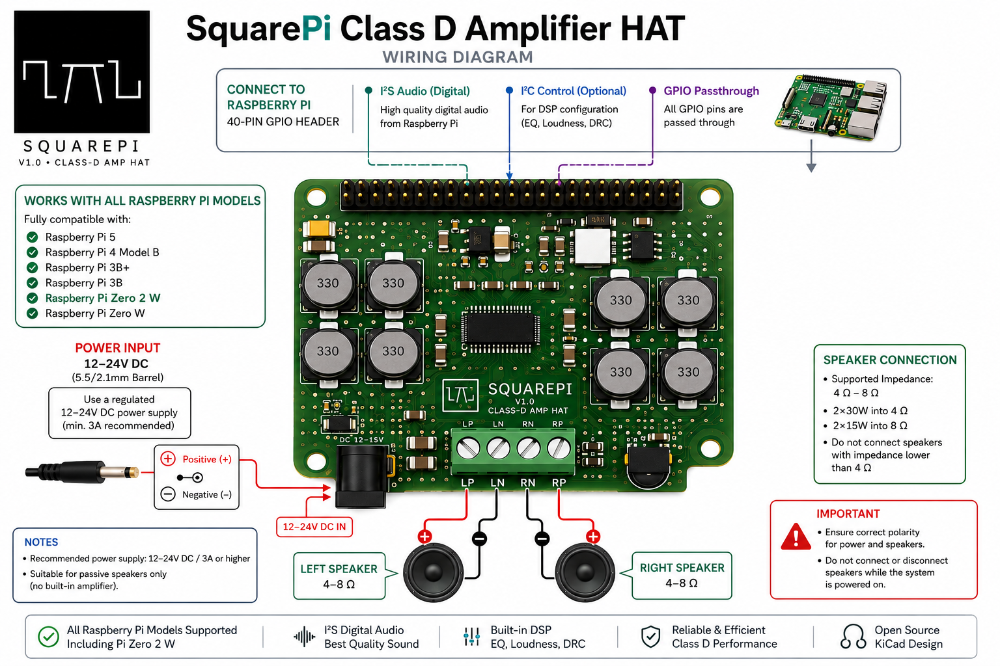
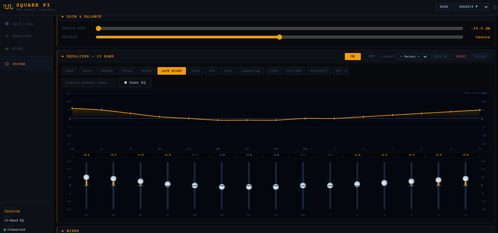
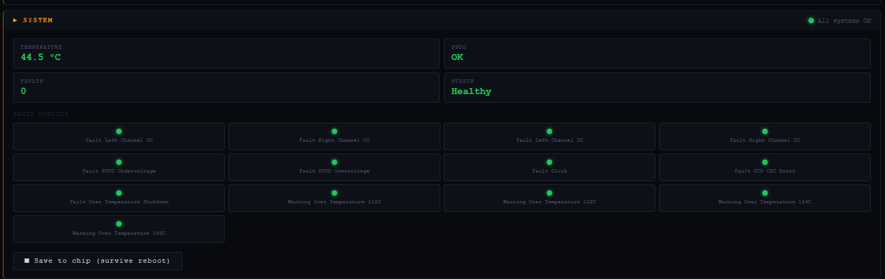

# SquarePi

[](https://github.com/sijah/Square_PI/releases)
[](LICENSE)
[](https://www.raspberrypi.com)
[](docs/audio-engine.md)
[](https://github.com/sijah/Square_PI)

**A Raspberry Pi HAT that turns any Pi into a 2×30W hi-fi wireless speaker system.**

One install command sets up the audio driver, music player, web UI, Bluetooth, DLNA, Spotify Connect, AirPlay, and a 15-band hardware DSP equalizer. After a reboot it's reachable at `squarepi.local` from any phone or browser — no app, no account, no cloud.

> *From square wave to every corner.* — Sijah AK



---

## At a glance

| | |
|---|---|
| Output | **2×30W** stereo Class-D |
| Audio quality | **48kHz / 24-bit** — automatic upscaling on all sources |
| Cost | **Under $30** in parts |
| Protocols | **7** — BT · DLNA · Spotify · AirPlay · USB · Radio · MPD |
| Setup | **One command** — `sudo bash install.sh` (Bluetooth + EQ UI included) |
| Control | **Browser UI** — `squarepi.local`, no app install |
| Cloud | **None** — fully local, no account, no subscription |

---

## What it plays from

| Protocol | How it works |
|---|---|
| **Bluetooth A2DP** | Pair any phone or tablet — no PIN, auto-pair, always discoverable |
| **DLNA / UPnP** | Stream from Windows Media Player, Kodi, VLC, or any DLNA app |
| **Spotify Connect** | SquarePi appears as a speaker in the Spotify app (Premium required) |
| **AirPlay** | Stream from iPhone, iPad, Mac — no Apple account needed |
| **USB Drive** | Plug in a drive — library auto-scans, no steps required |
| **Internet Radio** | Built-in streaming, hundreds of stations, no extra app |
| **MPD clients** | Any MPD-compatible app on any OS auto-discovers SquarePi |

All sources can be active simultaneously — ALSA dmix mixes them at the hardware layer.

---

## SquarePi Audio Engine™

Every source — Bluetooth from a phone, MP3 from a USB stick, 44.1kHz FLAC from DLNA — passes through four automatic stages before it reaches the speakers.

### 1 — SquarePi Upscaler™
All audio is upscaled to **48kHz / 24-bit**. The Pi's hardware clock is ~10× more accurate at 48kHz than 44.1kHz, making this the correct native operating rate.

### 2 — SquarePi Resampler™
Rate conversion uses **SoXR** — a polyphase resampling library used in professional audio tools. 44.1kHz converts to 48kHz via a 160:147 integer ratio at "very high" quality. [Technical details →](docs/audio-engine.md)

### 3 — SquarePi Mixer™
Multiple sources share the output via ALSA dmix at 48kHz / S32_LE. Bluetooth and DLNA playing at the same time works without either pausing.

### 4 — SquarePi EQ™
15-band parametric EQ running inside the TAS5805M chip over I²C — no CPU involvement, no latency. [Technical details →](docs/audio-engine.md)

---

## SquarePi EQ™

### 13 Presets

| Preset | Character |
|---|---|
| EQ Flat | Neutral reference |
| EQ Bass Boost | Warm bass emphasis |
| EQ Treble | Bright, airy detail |
| EQ Vocal | Mid-forward, clear voices |
| EQ Night Mode | Gentle, low-fatigue listening |
| EQ Late Night | Boosted bass and air, low mids |
| EQ Rock | Punchy low-end, scooped mids |
| EQ Pop | Clear vocals, sparkly highs |
| EQ Jazz | Warm, slightly rolled-off |
| EQ Classical | Flat with gentle treble lift |
| EQ Club | Heavy bass, extended highs |
| EQ Hip-Hop | Deep sub-bass, forward mids |
| EQ Acoustic | Natural room character |

All 13 presets are installed by default. Find them in myMPD under **Scripts**.

### 15 EQ Bands

| Band | Freq | Band | Freq | Band | Freq |
|---|---|---|---|---|---|
| 1 | 20 Hz | 6 | 200 Hz | 11 | 2 kHz |
| 2 | 32 Hz | 7 | 315 Hz | 12 | 3.15 kHz |
| 3 | 50 Hz | 8 | 500 Hz | 13 | 5 kHz |
| 4 | 80 Hz | 9 | 800 Hz | 14 | 8 kHz |
| 5 | 125 Hz | 10 | 1.25 kHz | 15 | 16 kHz |

Range: ±15 dB per band. Runs in the TAS5805M chip — the Pi CPU is not involved.

### Visual DSP Interface (installed by default)

Open `http://squarepi.local:8081` for the full real-time DSP control panel.



- **15 fader sliders** — DSP updates on every move
- **Frequency response graph** — live curve, amber = boost, blue = cut
- **Custom preset** — save your own curve
- **Analog Gain** — hardware output trim (0 to −15.5 dB)
- **Balance** — L/R pan
- **Mixer Mode** — `Stereo` / `Mono` / `Left` / `Right` (crossfeed matrix via separate L2L / R2L / L2R / R2R gain controls)
- **Save to chip** — settings survive power cycles (`alsactl store`)

Terminal access via `alsamixer` → `F6` → `LouderRaspberry`.

---

## Real-time Fault Monitor



Live readout from TAS5805M chip registers — available in the DSP UI (installed by default):

| Fault | Meaning |
|---|---|
| Left / Right Channel OC | Output overcurrent — speaker short or overload |
| Left / Right Channel DC | DC fault — amp protection triggered |
| PVDD Undervoltage / Overvoltage | Supply voltage out of range |
| Clock | I2S clock fault |
| Over Temperature Shutdown | Chip too hot, output disabled |
| Warning 112°C / 122°C / 134°C / 146°C | Thermal warning thresholds |

Green = clear. Red = active. All faults self-clear when the condition resolves.

---

## Control & UI

| Interface | Address | Notes |
|---|---|---|
| myMPD web UI | `http://squarepi.local:8080` · `https://squarepi.local:8443` | Mobile-optimised, always installed |
| EQ DSP UI | `http://squarepi.local:8081` | Installed by default (skip with `--without-eq`) |
| MPD (music apps) | `squarepi.local:6600` | Auto-discovered by M.A.L.P, MPDroid, Cantata |
| DLNA renderer | Appears as `SquarePi` in DLNA apps | With `--with-dlna` |

No IP address needed — everything is reachable by hostname.

### Sleep Timer

Built into every install — find in myMPD → **Scripts**:

| Script | Action |
|---|---|
| Sleep_30min | Stop playback after 30 minutes |
| Sleep_60min | Stop playback after 60 minutes |
| Sleep_90min | Stop playback after 90 minutes |
| Sleep_Cancel | Cancel a running timer |

---

## Setup

### Requirements

- Raspberry Pi (Zero 2W · 3B+ · 4B · Pi 5 in development)
- Raspberry Pi OS Lite — Bookworm (Debian 12) or Trixie (Debian 13)
- SquarePi HAT connected
- Internet connection on the Pi
- SSH or local terminal

### One-command install (recommended)

The default install includes **Bluetooth and the EQ web UI** — the two defining features — alongside MPD, myMPD, EQ presets, and the sleep timer:

```bash
curl -fsSL https://raw.githubusercontent.com/sijah/Square_PI/main/squarepi-installer/install.sh | sudo bash
```

### Add optional protocols

DLNA, Spotify Connect, and AirPlay are opt-in:

```bash
# Add DLNA/UPnP renderer
... | sudo bash -s -- --with-dlna

# Add Spotify Connect
... | sudo bash -s -- --with-spotify

# Add AirPlay
... | sudo bash -s -- --with-airplay

# Everything (Bluetooth + EQ UI + DLNA + Spotify + AirPlay)
... | sudo bash -s -- --all
```

### Skip a default feature

```bash
# Skip Bluetooth
... | sudo bash -s -- --without-bt

# Skip the EQ web UI (EQ presets in myMPD remain)
... | sudo bash -s -- --without-eq
```

If a BlueALSA package isn't available on your OS image, the installer logs a warning and continues without Bluetooth — the core install never aborts.

### Clone and run locally

```bash
git clone https://github.com/sijah/Square_PI.git
cd Square_PI/squarepi-installer

sudo bash install.sh                      # Bluetooth + EQ UI (default)
sudo bash install.sh --all                # everything
sudo bash install.sh --without-bt         # skip Bluetooth
```

### Optional: auto-reboot and custom hostname

```bash
sudo SQUAREPI_HOSTNAME=squarepi SQUAREPI_AUTO_REBOOT=1 bash install.sh
```

### After install

```bash
sudo reboot
```

Verify audio card loaded:

```bash
aplay -l    # should show LouderRaspberry
```

Open myMPD: `http://squarepi.local:8080`

> **First boot defaults:** Volume at 25%. EQ initialised to flat (all bands 0 dB).

[Full setup guide with OS flashing, first boot, and troubleshooting →](docs/setup.md)

---

## SquarePi vs Commercial Alternatives

| | **SquarePi** | Sonos Era 100 | Amazon Echo Studio |
|---|---|---|---|
| Price | **< $30 parts** | $249 | $199 |
| Cloud | **None** | Required | Required |
| Account | **None** | Sonos account | Amazon account |
| Data collection | **None** | Yes | Yes |
| Subscription | **None** | Some features | Some features |
| Protocols | **BT · DLNA · Spotify · AirPlay · USB · Radio** | BT · AirPlay · Spotify | BT · AirPlay |
| EQ | **15-band hardware DSP** | 3-band app sliders | 3-band app sliders |
| Audio upscaling | **48kHz / 24-bit** | None | None |
| Open source | **Yes (MIT)** | No | No |
| Setup | **One command** | App + account | App + account |

---

## Who It's For

- **Makers and hobbyists** — open hardware, open software, real specs
- **Non-technical families** — one command, works from any phone browser
- **DIY audio community** — KiCad files, full BOM, Gerbers in Releases
- **Privacy-conscious users** — fully local, no account, no telemetry
- **Anyone tired of subscriptions** — music you control on hardware you own

---

## Hardware

### Core Specifications

| Parameter | Value |
|---|---|
| Amplifier chip | Texas Instruments TAS5805M |
| Output power | 2×30W into 4Ω at 24V · 2×23W into 8Ω at 24V · 2×13W into 4Ω at 12V |
| Audio input | I2S digital from Raspberry Pi GPIO |
| DSP | Onboard TAS5805M — 15-band EQ, 3-band DRC, gain control, all via I²C |
| Supply | 12–24V DC, barrel jack |
| 5V rail | XL1509-5.0 buck converter (powers Pi too — no separate Pi power supply) |
| Form factor | Standard 40-pin RPi HAT, 65×61mm, 2-layer PCB |
| Outputs | Screw terminals: LP LN RN RP |
| Extras | IR receiver footprint, HAT EEPROM (auto Pi recognition) |

### DSP Technical Specs

| Parameter | Value |
|---|---|
| THD+N | ≤ 0.03% at 1W, 1kHz |
| SNR | up to 107 dB (A-weighted, 24V / 8Ω) |
| Dynamic range | up to 106 dB (A-weighted, 24V / 8Ω) |
| Crosstalk | −100 dB at 1kHz |
| Parametric EQ | 15 bands per channel, full biquad |
| DRC | 3-band, 4th-order |
| Volume range | +24 dB to −103 dB, 0.5 dB steps |
| Sample rates | 32 / 44.1 / 48 / 88.2 / 96 kHz |

### Power Wiring

| Supply | Min current | Output |
|---|---|---|
| 12V | 3A | ~13W/ch into 4Ω |
| 19V | 3A | ~20W/ch into 8Ω |
| 24V | 3A | ~23W/ch into 8Ω |

> Check polarity before powering on. Use passive 4–8Ω speakers only. Never connect speakers while powered.

### Speaker Terminals

| Terminal | Connection |
|---|---|
| `LP` | Left + |
| `LN` | Left − |
| `RN` | Right − |
| `RP` | Right + |

### Thermal

Designed for heatsink-less operation. For long-term reliability:

- Use **12V with 8Ω speakers** for cool continuous operation
- Avoid sustained high-volume with 4Ω speakers above 12V
- TAS5805M includes automatic thermal foldback — reduces output at high temperature, recovers automatically

### Design Files

Hardware designed in **KiCad**. PCB fabricated at **JLCPCB**.

- Gerbers, BOM, KiCad project: [GitHub Releases](https://github.com/sijah/Square_PI/releases)
- Driver: [sonocotta/tas5805m-driver-for-raspbian](https://github.com/sonocotta/tas5805m-driver-for-raspbian)

---

## Raspberry Pi Compatibility

| Model | Status |
|---|---|
| Pi Zero 2W | Primary target — tested, recommended |
| Pi 3B+ | Tested |
| Pi 4B | Tested |
| Pi 5 | In development |

---

## What Gets Installed

<details>
<summary>Always installed (base)</summary>

| Component | Purpose |
|---|---|
| `tas58xx` kernel driver | I2S/I2C amplifier driver |
| Boot overlay | Enables I2S, loads SquarePi audio overlay |
| `mpd` | Music Player Daemon |
| `mpc` | MPD command-line client |
| `alsa-utils` | `aplay`, `alsamixer`, `speaker-test` |
| `mympd` | Mobile-friendly web UI |
| `avahi-daemon` | mDNS — `squarepi.local` on any network |
| `exfatprogs` | exFAT USB drive support |
| EQ preset Lua scripts | 13 one-tap presets in myMPD Scripts |
| Sleep timer Lua scripts | 30 / 60 / 90 min + Cancel in myMPD Scripts |
| `squarepi-eq-init.service` | Sets EQ flat on first boot, then disables itself |

</details>

<details>
<summary>Bluetooth (default — skip with --without-bt)</summary>

| Component | Purpose |
|---|---|
| `bluez` + `bluez-tools` | Bluetooth stack |
| `bluez-alsa-utils` | BlueALSA, routes BT audio to ALSA |
| `squarepi-bt-agent` | Auto-accept pairing, no PIN |
| `squarepi-bt-setup.service` | Keeps adapter discoverable and pairable after every reboot |
| `/etc/asound.conf` dmix + softvol | Shared ALSA output — BT and MPD play simultaneously; BT Volume control |

</details>

<details>
<summary>EQ web UI (default — skip with --without-eq)</summary>

| Component | Purpose |
|---|---|
| `squarepi-eq-server.py` | DSP web UI on port 8081 |
| `squarepi-eq.service` | Systemd unit, starts after sound target |
| `squarepi-alsa-restore.service` | Restores saved EQ state at every boot |

</details>

<details>
<summary>With --with-dlna</summary>

| Component | Purpose |
|---|---|
| `upmpdcli` | UPnP/DLNA renderer, bridges MPD to DLNA |

</details>

<details>
<summary>With --with-spotify</summary>

| Component | Purpose |
|---|---|
| `raspotify` | Spotify Connect daemon |

</details>

<details>
<summary>With --with-airplay</summary>

| Component | Purpose |
|---|---|
| `shairport-sync` | AirPlay receiver |

</details>

---

## Adding Music

Default MPD library: `/var/lib/mpd/music`

```bash
sudo cp -r /path/to/music/* /var/lib/mpd/music/
sudo chown -R mpd:audio /var/lib/mpd/music
mpc update
```

Internet radio: add streams in myMPD → **Browse > Webradio**.

USB drive: see [docs/setup.md](docs/setup.md) for full mount instructions.

---

## Branding / White-label Options

```bash
sudo SQUAREPI_HOSTNAME=myplayer \
     SQUAREPI_BT_NAME="Living Room" \
     SQUAREPI_BRAND_NAME="MyPlayer" \
     bash install.sh --all
```

| Variable | Purpose |
|---|---|
| `SQUAREPI_HOSTNAME` | Pi hostname |
| `SQUAREPI_BT_NAME` | Bluetooth device name |
| `SQUAREPI_BRAND_NAME` | Name in installer banners |
| `SQUAREPI_TAGLINE` | Tagline in installer banner |
| `SQUAREPI_AUTO_REBOOT` | Set `1` to reboot automatically after install |

---

## Troubleshooting

<details>
<summary>Audio card not found</summary>

```bash
aplay -l
dmesg | grep -i tas58
lsmod | grep tas
```

</details>

<details>
<summary>MPD not working</summary>

```bash
sudo systemctl status mpd
journalctl -u mpd -n 50
mpc status
```

If ALSA card name differs from `LouderRaspberry`, update `/etc/mpd.conf`:

```conf
device "plughw:<card-name>,0"
```

</details>

<details>
<summary>DSP UI not loading</summary>

```bash
systemctl status squarepi-eq
journalctl -u squarepi-eq -n 30
curl http://127.0.0.1:8081
```

</details>

<details>
<summary>Bluetooth not visible</summary>

```bash
rfkill list
sudo rfkill unblock bluetooth
sudo systemctl restart bluetooth squarepi-bt-agent squarepi-bt-setup
```

If pairing fails with `Authentication Failed`, remove old pairing:

```bash
sudo bluetoothctl
remove <MAC-address>
scan on
```

</details>

<details>
<summary>Pi does not boot after install</summary>

Mount boot partition on another computer and comment out SquarePi lines in `config.txt`:

```conf
# dtparam=i2s=on
# dtoverlay=tas58xx,i2creg=...
```

A timestamped backup is created automatically: `config.txt.squarepi.bak.YYYYMMDDHHMMSS`

</details>

<details>
<summary>myMPD not reachable</summary>

```bash
sudo systemctl status mympd
curl -fs http://127.0.0.1:8080
```

</details>

<details>
<summary>USB drive not visible in MPD</summary>

```bash
lsblk -f
findmnt /mnt/usb-music
sudo -u mpd ls /mnt/usb-music
```

Use UUID in `/etc/fstab`, include `uid=mpd,gid=audio` for FAT/exFAT, run `mpc update` after mounting.
See [docs/setup.md](docs/setup.md) for full instructions.

</details>

---

## Uninstall

```bash
curl -fsSL https://raw.githubusercontent.com/sijah/Square_PI/main/squarepi-installer/uninstall.sh | sudo bash
```

Removes all SquarePi components. Prompts before deleting music data. Music files are not deleted unless confirmed.

---

## Documentation

| Document | Contents |
|---|---|
| [docs/audio-engine.md](docs/audio-engine.md) | How the audio pipeline works — upscaling, resampling, mixing, DSP EQ |
| [docs/supported-protocols.md](docs/supported-protocols.md) | Setup and usage for all 7 protocols |
| [docs/setup.md](docs/setup.md) | Full guide: OS flash → HAT → install → first boot → troubleshoot |
| [ABOUT.md](ABOUT.md) | Full project pitch for press and feature requests |

---

## Contributing

Issues, pull requests, and forks welcome.

- Installer: single self-contained bash script — `squarepi-installer/install.sh`
- DSP server: plain Python stdlib — `squarepi-installer/eq-server.py`
- Hardware: KiCad files in [Releases](https://github.com/sijah/Square_PI/releases)
- No build step — clone, edit, test on Pi

---

## License

MIT — do what you want. Attribution appreciated.

---

*From square wave to every corner.* — [Sijah AK](https://github.com/sijah)
